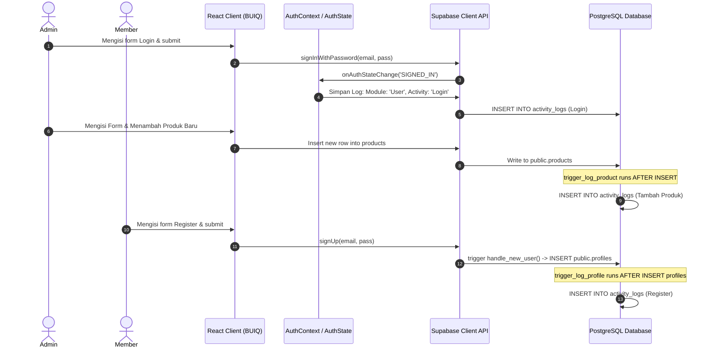

# Product Requirements Document (PRD)
## Fitur: Activity Log (Audit Trail)

| Project | BUIQ CRM |
| :--- | :--- |
| **Framework** | React JS (Vite) |
| **Database** | Supabase PostgreSQL |
| **Styling** | Tailwind CSS |
| **UI Components** | Shadcn UI / Custom Tailwind Components |
| **Role** | Software Architect |

---

## 1. TUJUAN FITUR
Modul **Activity Log** berfungsi sebagai *Audit Trail* sistem BUIQ CRM untuk mencatat, melacak, dan memantau seluruh aktivitas penting yang dilakukan oleh Admin maupun sistem. Hal ini sangat krusial untuk aspek keamanan, akuntabilitas, dan pelacakan kesalahan (debugging).
- **Aksesibilitas:** Hanya pengguna dengan role **Admin** yang dapat mengakses halaman Activity Log.
- **Batasan Member:** Pengguna dengan role **Member** tidak memiliki akses sama sekali ke halaman maupun data Activity Log (dibatasi melalui RLS Policy dan Routing Frontend).

---

## 2. AKTIVITAS YANG DICATAT
Aktivitas berikut wajib dicatat ke dalam database:

| Modul | Aktivitas | Deskripsi Log |
| :--- | :--- | :--- |
| **User** | Login | Pengguna berhasil masuk ke sistem |
| | Logout | Pengguna keluar dari sistem |
| | Register | Pendaftaran akun member baru |
| | Reset Password | Perubahan password akun pengguna |
| **Product** | Tambah Produk | Penambahan produk baru ke dalam inventori |
| | Edit Produk | Perubahan data produk |
| | Hapus Produk | Penghapusan produk dari inventori |
| **Customer** | Tambah Customer | Penambahan data customer baru |
| | Edit Customer | Perubahan data profil customer |
| | Hapus Customer | Penghapusan data customer |
| **Orders** | Tambah Order | Pembuatan order baru |
| | Edit Order | Perubahan data order |
| | Hapus Order | Penghapusan data order |
| | Status Order Completed | Status order diubah menjadi Completed |
| | Status Order Cancelled | Status order diubah menjadi Cancelled |
| **User Management** | Tambah User | Admin membuat user baru |
| | Edit User | Admin mengubah nama lengkap/profil user |
| | Ubah Role | Perubahan hak akses user (Admin ↔ Member) |
| | Nonaktifkan User | Akun dinonaktifkan (banned) |
| | Aktifkan User | Akun diaktifkan kembali |
| | Hapus User | Akun di-soft delete |
| **Membership** | Point bertambah | Penambahan poin loyalitas customer |
| | Membership Tier berubah | Kenaikan/penurunan tier keanggotaan |
| | Voucher berhasil ditukar | Penukaran poin loyalitas dengan voucher |

---

## 3. DATABASE DESIGN & ERD

### Tabel `public.activity_logs`
Tabel ini dibuat secara independen namun memiliki relasi *foreign key* yang mengarah ke `auth.users` untuk melacak pelaku aktivitas. Jika user dihapus (*soft-delete* atau *hard-delete*), log tetap dipertahankan dengan relasi `ON DELETE SET NULL` dan pencatatan nama pelaku yang redundan secara tekstual (`user_name` & `user_role`) untuk histori permanen.

```
+--------------------------------------------------------+
|                    activity_logs                       |
+--------------------------------------------------------+
| [PK] id            : uuid (default: gen_random_uuid()) |
| [FK] user_id       : uuid REFERENCES auth.users        |
|      user_name     : text                              |
|      user_role     : text                              |
|      module        : text                              |
|      activity      : text                              |
|      description   : text                              |
|      reference_id  : text (nullable)                   |
|      created_at    : timestamp with time zone          |
+--------------------------------------------------------+
```

### Relasi Tabel
- `public.activity_logs.user_id` ➔ `auth.users.id` (Many-to-One, `ON DELETE SET NULL`)

---

## 4. SQL MIGRATION SUPABASE (DDL)

Berikut adalah script SQL lengkap untuk membuat tabel `activity_logs`, mengaktifkan RLS, serta membuat trigger otomatisasi audit trail pada operasi database.

```sql
-- =========================================================
-- MIGRATION: ACTIVITY LOG MODULE
-- =========================================================

-- 1. Create Tabel activity_logs
CREATE TABLE IF NOT EXISTS public.activity_logs (
    id uuid PRIMARY KEY DEFAULT gen_random_uuid(),
    user_id uuid REFERENCES auth.users(id) ON DELETE SET NULL,
    user_name text NOT NULL,
    user_role text NOT NULL,
    module text NOT NULL,
    activity text NOT NULL,
    description text NOT NULL,
    reference_id text,
    created_at timestamp with time zone DEFAULT timezone('utc'::text, now()) NOT NULL
);

-- Indexing untuk mempercepat filter dan pencarian
CREATE INDEX IF NOT EXISTS idx_activity_logs_created_at ON public.activity_logs(created_at DESC);
CREATE INDEX IF NOT EXISTS idx_activity_logs_module ON public.activity_logs(module);
CREATE INDEX IF NOT EXISTS idx_activity_logs_user_name ON public.activity_logs(user_name);

-- 2. Aktifkan Row Level Security (RLS)
ALTER TABLE public.activity_logs ENABLE ROW LEVEL SECURITY;

-- 3. Kebijakan RLS (Policy)
-- Hanya Admin yang boleh membaca (SELECT) logs
DROP POLICY IF EXISTS "Admins can view activity logs" ON public.activity_logs;
CREATE POLICY "Admins can view activity logs" ON public.activity_logs
  FOR SELECT TO authenticated
  USING (
    EXISTS (
      SELECT 1 FROM public.profiles
      WHERE profiles.id = auth.uid() AND profiles.role = 'admin'
    )
  );

-- Pengguna terautentikasi dapat menambahkan (INSERT) logs (untuk pelaporan client-side)
DROP POLICY IF EXISTS "Authenticated users can insert activity logs" ON public.activity_logs;
CREATE POLICY "Authenticated users can insert activity logs" ON public.activity_logs
  FOR INSERT TO authenticated
  WITH CHECK (true);

-- UPDATE dan DELETE dikosongkan (secara default ditolak) untuk menjamin kekekalan Audit Trail.

-- 4. Trigger & Helper Functions untuk Otomatisasi Log di Database

-- A. Trigger untuk Tabel Products
CREATE OR REPLACE FUNCTION public.log_product_activity()
RETURNS trigger AS $$
DECLARE
  v_user_id uuid;
  v_user_name text;
  v_user_role text;
BEGIN
  v_user_id := auth.uid();
  IF v_user_id IS NOT NULL THEN
    SELECT full_name, role INTO v_user_name, v_user_role FROM public.profiles WHERE id = v_user_id;
  ELSE
    v_user_name := 'System';
    v_user_role := 'system';
  END IF;

  IF TG_OP = 'INSERT' THEN
    INSERT INTO public.activity_logs (user_id, user_name, user_role, module, activity, description, reference_id)
    VALUES (v_user_id, COALESCE(v_user_name, 'System'), COALESCE(v_user_role, 'system'), 'Product', 'Tambah Produk', 'Menambahkan produk baru: ' || NEW.product_name || ' (Code: ' || NEW.product_code || ')', NEW.id::text);
  ELSIF TG_OP = 'UPDATE' THEN
    INSERT INTO public.activity_logs (user_id, user_name, user_role, module, activity, description, reference_id)
    VALUES (v_user_id, COALESCE(v_user_name, 'System'), COALESCE(v_user_role, 'system'), 'Product', 'Edit Produk', 'Mengubah data produk: ' || NEW.product_name || ' (Code: ' || NEW.product_code || ')', NEW.id::text);
  ELSIF TG_OP = 'DELETE' THEN
    INSERT INTO public.activity_logs (user_id, user_name, user_role, module, activity, description, reference_id)
    VALUES (v_user_id, COALESCE(v_user_name, 'System'), COALESCE(v_user_role, 'system'), 'Product', 'Hapus Produk', 'Menghapus produk: ' || OLD.product_name || ' (Code: ' || OLD.product_code || ')', OLD.id::text);
  END IF;
  RETURN NULL;
END;
$$ LANGUAGE plpgsql SECURITY DEFINER;

DROP TRIGGER IF EXISTS trigger_log_product ON public.products;
CREATE TRIGGER trigger_log_product
AFTER INSERT OR UPDATE OR DELETE ON public.products
FOR EACH ROW EXECUTE FUNCTION public.log_product_activity();


-- B. Trigger untuk Tabel Customers
CREATE OR REPLACE FUNCTION public.log_customer_activity()
RETURNS trigger AS $$
DECLARE
  v_user_id uuid;
  v_user_name text;
  v_user_role text;
BEGIN
  v_user_id := auth.uid();
  IF v_user_id IS NOT NULL THEN
    SELECT full_name, role INTO v_user_name, v_user_role FROM public.profiles WHERE id = v_user_id;
  ELSE
    v_user_name := 'System';
    v_user_role := 'system';
  END IF;

  IF TG_OP = 'INSERT' THEN
    INSERT INTO public.activity_logs (user_id, user_name, user_role, module, activity, description, reference_id)
    VALUES (v_user_id, COALESCE(v_user_name, 'System'), COALESCE(v_user_role, 'system'), 'Customer', 'Tambah Customer', 'Menambahkan customer baru: ' || NEW.full_name || ' (Code: ' || NEW.customer_code || ')', NEW.id::text);
  ELSIF TG_OP = 'UPDATE' THEN
    -- 1. Deteksi Perubahan Profil Utama
    IF (OLD.full_name <> NEW.full_name OR OLD.email <> NEW.email OR OLD.phone <> NEW.phone OR OLD.address <> NEW.address OR OLD.status <> NEW.status) THEN
      INSERT INTO public.activity_logs (user_id, user_name, user_role, module, activity, description, reference_id)
      VALUES (v_user_id, COALESCE(v_user_name, 'System'), COALESCE(v_user_role, 'system'), 'Customer', 'Edit Customer', 'Mengubah profil customer: ' || NEW.full_name || ' (Code: ' || NEW.customer_code || ')', NEW.id::text);
    END IF;

    -- 2. Deteksi Perubahan Point (Membership)
    IF OLD.points <> NEW.points THEN
      INSERT INTO public.activity_logs (user_id, user_name, user_role, module, activity, description, reference_id)
      VALUES (v_user_id, COALESCE(v_user_name, 'System'), COALESCE(v_user_role, 'system'), 'Membership', 'Point bertambah', 
        'Poin customer ' || NEW.full_name || ' ' || (CASE WHEN NEW.points > OLD.points THEN 'bertambah ' || (NEW.points - OLD.points) ELSE 'berkurang ' || (OLD.points - NEW.points) END) || ' poin. Total saat ini: ' || NEW.points, 
        NEW.id::text);
    END IF;

    -- 3. Deteksi Perubahan Tier (Membership)
    IF OLD.membership_tier <> NEW.membership_tier THEN
      INSERT INTO public.activity_logs (user_id, user_name, user_role, module, activity, description, reference_id)
      VALUES (v_user_id, COALESCE(v_user_name, 'System'), COALESCE(v_user_role, 'system'), 'Membership', 'Membership Tier berubah', 
        'Membership tier customer ' || NEW.full_name || ' berubah dari ' || OLD.membership_tier || ' menjadi ' || NEW.membership_tier, 
        NEW.id::text);
    END IF;

  ELSIF TG_OP = 'DELETE' THEN
    INSERT INTO public.activity_logs (user_id, user_name, user_role, module, activity, description, reference_id)
    VALUES (v_user_id, COALESCE(v_user_name, 'System'), COALESCE(v_user_role, 'system'), 'Customer', 'Hapus Customer', 'Menghapus customer: ' || OLD.full_name || ' (Code: ' || OLD.customer_code || ')', OLD.id::text);
  END IF;
  RETURN NULL;
END;
$$ LANGUAGE plpgsql SECURITY DEFINER;

DROP TRIGGER IF EXISTS trigger_log_customer ON public.customers;
CREATE TRIGGER trigger_log_customer
AFTER INSERT OR UPDATE OR DELETE ON public.customers
FOR EACH ROW EXECUTE FUNCTION public.log_customer_activity();


-- C. Trigger untuk Tabel Orders
CREATE OR REPLACE FUNCTION public.log_order_activity()
RETURNS trigger AS $$
DECLARE
  v_user_id uuid;
  v_user_name text;
  v_user_role text;
BEGIN
  v_user_id := auth.uid();
  IF v_user_id IS NOT NULL THEN
    SELECT full_name, role INTO v_user_name, v_user_role FROM public.profiles WHERE id = v_user_id;
  ELSE
    v_user_name := 'System';
    v_user_role := 'system';
  END IF;

  IF TG_OP = 'INSERT' THEN
    INSERT INTO public.activity_logs (user_id, user_name, user_role, module, activity, description, reference_id)
    VALUES (v_user_id, COALESCE(v_user_name, 'System'), COALESCE(v_user_role, 'system'), 'Orders', 'Tambah Order', 'Membuat pesanan baru ' || NEW.order_number || ' senilai Rp ' || to_char(NEW.total_price, 'FM999,999,999'), NEW.id::text);
  ELSIF TG_OP = 'UPDATE' THEN
    IF OLD.status <> NEW.status THEN
      IF NEW.status = 'Completed' THEN
        INSERT INTO public.activity_logs (user_id, user_name, user_role, module, activity, description, reference_id)
        VALUES (v_user_id, COALESCE(v_user_name, 'System'), COALESCE(v_user_role, 'system'), 'Orders', 'Status Order berubah menjadi Completed', 'Status pesanan ' || NEW.order_number || ' diselesaikan (Completed)', NEW.id::text);
      ELSIF NEW.status = 'Cancelled' THEN
        INSERT INTO public.activity_logs (user_id, user_name, user_role, module, activity, description, reference_id)
        VALUES (v_user_id, COALESCE(v_user_name, 'System'), COALESCE(v_user_role, 'system'), 'Orders', 'Status Order berubah menjadi Cancelled', 'Status pesanan ' || NEW.order_number || ' dibatalkan (Cancelled)', NEW.id::text);
      ELSE
        INSERT INTO public.activity_logs (user_id, user_name, user_role, module, activity, description, reference_id)
        VALUES (v_user_id, COALESCE(v_user_name, 'System'), COALESCE(v_user_role, 'system'), 'Orders', 'Edit Order', 'Mengubah status pesanan ' || NEW.order_number || ' menjadi ' || NEW.status, NEW.id::text);
      END IF;
    ELSE
      INSERT INTO public.activity_logs (user_id, user_name, user_role, module, activity, description, reference_id)
      VALUES (v_user_id, COALESCE(v_user_name, 'System'), COALESCE(v_user_role, 'system'), 'Orders', 'Edit Order', 'Mengubah detail pesanan: ' || NEW.order_number, NEW.id::text);
    END IF;
  ELSIF TG_OP = 'DELETE' THEN
    INSERT INTO public.activity_logs (user_id, user_name, user_role, module, activity, description, reference_id)
    VALUES (v_user_id, COALESCE(v_user_name, 'System'), COALESCE(v_user_role, 'system'), 'Orders', 'Hapus Order', 'Menghapus pesanan: ' || OLD.order_number, OLD.id::text);
  END IF;
  RETURN NULL;
END;
$$ LANGUAGE plpgsql SECURITY DEFINER;

DROP TRIGGER IF EXISTS trigger_log_order ON public.orders;
CREATE TRIGGER trigger_log_order
AFTER INSERT OR UPDATE OR DELETE ON public.orders
FOR EACH ROW EXECUTE FUNCTION public.log_order_activity();


-- D. Trigger untuk Tabel Profiles (User Management & Register)
CREATE OR REPLACE FUNCTION public.log_profile_activity()
RETURNS trigger AS $$
DECLARE
  v_user_id uuid;
  v_user_name text;
  v_user_role text;
BEGIN
  v_user_id := auth.uid();
  IF v_user_id IS NOT NULL THEN
    SELECT full_name, role INTO v_user_name, v_user_role FROM public.profiles WHERE id = v_user_id;
  ELSE
    v_user_name := 'System';
    v_user_role := 'system';
  END IF;

  IF TG_OP = 'INSERT' THEN
    -- Pendaftaran akun baru
    INSERT INTO public.activity_logs (user_id, user_name, user_role, module, activity, description, reference_id)
    VALUES (NEW.id, NEW.full_name, NEW.role, 'User', 'Register', 'Pengguna baru ' || NEW.full_name || ' mendaftar dengan hak akses ' || NEW.role, NEW.id::text);
  ELSIF TG_OP = 'UPDATE' THEN
    -- Deteksi Perubahan Role
    IF OLD.role <> NEW.role THEN
      INSERT INTO public.activity_logs (user_id, user_name, user_role, module, activity, description, reference_id)
      VALUES (v_user_id, COALESCE(v_user_name, 'System'), COALESCE(v_user_role, 'system'), 'User Management', 'Ubah Role', 'Mengubah role ' || NEW.full_name || ' dari ' || OLD.role || ' menjadi ' || NEW.role, NEW.id::text);
    -- Deteksi Soft Delete
    ELSIF NEW.full_name LIKE '[Deleted]%' AND NOT OLD.full_name LIKE '[Deleted]%' THEN
      -- Diabaikan karena dicatat langsung di delete_user_account RPC
      NULL;
    -- Deteksi Perubahan Nama Profil
    ELSIF OLD.full_name <> NEW.full_name THEN
      INSERT INTO public.activity_logs (user_id, user_name, user_role, module, activity, description, reference_id)
      VALUES (v_user_id, COALESCE(v_user_name, 'System'), COALESCE(v_user_role, 'system'), 'User Management', 'Edit User', 'Mengubah nama profil dari ' || OLD.full_name || ' menjadi ' || NEW.full_name, NEW.id::text);
    END IF;
  END IF;
  RETURN NULL;
END;
$$ LANGUAGE plpgsql SECURITY DEFINER;

DROP TRIGGER IF EXISTS trigger_log_profile ON public.profiles;
CREATE TRIGGER trigger_log_profile
AFTER INSERT OR UPDATE ON public.profiles
FOR EACH ROW EXECUTE FUNCTION public.log_profile_activity();


-- E. Injeksi Pencatatan Audit Trail ke dalam Fungsi RPC User Management Eksisting

-- Modifikasi RPC toggle_user_status untuk mencatat aktivitas Ban/Unban
CREATE OR REPLACE FUNCTION public.toggle_user_status(user_id uuid, ban boolean)
RETURNS void
SECURITY DEFINER
AS $$
DECLARE
  v_user_email text;
  v_admin_id uuid;
  v_admin_name text;
  v_admin_role text;
BEGIN
  -- Access check
  v_admin_id := auth.uid();
  IF NOT EXISTS (
    SELECT 1 FROM public.profiles
    WHERE profiles.id = v_admin_id AND profiles.role = 'admin'
  ) THEN
    RAISE EXCEPTION 'Access denied. Administrator privileges required.';
  END IF;

  IF user_id = v_admin_id THEN
    RAISE EXCEPTION 'You cannot enable/disable your own account.';
  END IF;

  SELECT email INTO v_user_email FROM auth.users WHERE id = user_id;
  SELECT full_name, role INTO v_admin_name, v_admin_role FROM public.profiles WHERE id = v_admin_id;

  IF ban THEN
    UPDATE auth.users
    SET banned_until = '3000-01-01 00:00:00+00'::timestamp with time zone
    WHERE id = user_id;

    -- Catat log nonaktifkan
    INSERT INTO public.activity_logs (user_id, user_name, user_role, module, activity, description, reference_id)
    VALUES (v_admin_id, COALESCE(v_admin_name, 'Admin'), COALESCE(v_admin_role, 'admin'), 'User Management', 'Nonaktifkan User', 'Menonaktifkan akses pengguna: ' || COALESCE(v_user_email, user_id::text), user_id::text);
  ELSE
    UPDATE auth.users
    SET banned_until = NULL
    WHERE id = user_id;

    -- Catat log aktifkan
    INSERT INTO public.activity_logs (user_id, user_name, user_role, module, activity, description, reference_id)
    VALUES (v_admin_id, COALESCE(v_admin_name, 'Admin'), COALESCE(v_admin_role, 'admin'), 'User Management', 'Aktifkan User', 'Mengaktifkan kembali akses pengguna: ' || COALESCE(v_user_email, user_id::text), user_id::text);
  END IF;
END;
$$ LANGUAGE plpgsql;

-- Modifikasi RPC delete_user_account untuk mencatat aktivitas Soft Delete
CREATE OR REPLACE FUNCTION public.delete_user_account(user_id uuid)
RETURNS void
SECURITY DEFINER
AS $$
DECLARE
  v_email text;
  v_admin_id uuid;
  v_admin_name text;
  v_admin_role text;
BEGIN
  -- Access check
  v_admin_id := auth.uid();
  IF NOT EXISTS (
    SELECT 1 FROM public.profiles
    WHERE profiles.id = v_admin_id AND profiles.role = 'admin'
  ) THEN
    RAISE EXCEPTION 'Access denied. Administrator privileges required.';
  END IF;

  IF user_id = v_admin_id THEN
    RAISE EXCEPTION 'You cannot delete your own account.';
  END IF;

  SELECT email INTO v_email FROM auth.users WHERE id = user_id;
  SELECT full_name, role INTO v_admin_name, v_admin_role FROM public.profiles WHERE id = v_admin_id;

  -- Delete customer record by email (cascades to orders)
  IF v_email IS NOT NULL THEN
    DELETE FROM public.customers WHERE email = v_email;
  END IF;

  -- Soft delete auth user
  UPDATE auth.users
  SET banned_until = '3000-01-01 00:00:00+00'::timestamp with time zone
  WHERE id = user_id;

  UPDATE public.profiles
  SET full_name = '[Deleted] ' || full_name
  WHERE id = user_id AND NOT full_name LIKE '[Deleted]%';

  -- Catat log soft delete
  INSERT INTO public.activity_logs (user_id, user_name, user_role, module, activity, description, reference_id)
  VALUES (v_admin_id, COALESCE(v_admin_name, 'Admin'), COALESCE(v_admin_role, 'admin'), 'User Management', 'Hapus User', 'Melakukan soft-delete dan memblokir login untuk: ' || COALESCE(v_email, user_id::text), user_id::text);
END;
$$ LANGUAGE plpgsql;
```

---

## 5. FLOW SISTEM

Alur perekaman aktivitas berjalan secara paralel antara aksi di sisi Klien (React) dan pemicu otomatisasi di sisi Server (PostgreSQL Triggers):



---

## 6. STRUKTUR FOLDER REACT & SERVICE LAYER

Untuk menjaga kebersihan kode dan pemisahan logika, kita akan menambahkan file service baru serta halaman log aktivitas.

### Struktur Folder Baru
```
d:\pfl\
├── src\
│   ├── services\
│   │   └── activityLogService.js    <-- [NEW] Service untuk tabel activity_logs
│   ├── pages\
│   │   └── ActivityLog.jsx          <-- [NEW] Halaman admin untuk melihat Activity Logs
│   ├── components\
│   │   └── Sidebar.jsx              <-- [MODIFY] Tambah NavLink ke /activity-log
│   └── App.jsx                      <-- [MODIFY] Tambah rute /activity-log
```

### Kode Service Layer: `src/services/activityLogService.js`
Service ini menangani integrasi Supabase Client untuk pembacaan dan penyimpanan manual data logs.

```javascript
import { supabase } from "../lib/supabaseClient";

export const activityLogService = {
  /**
   * Mengambil logs dengan filter, pencarian, pagination, dan sorting
   */
  async getAll({ page = 1, limit = 10, search = "", module = "All", role = "All", activity = "All", startDate = "", endDate = "", sortBy = "created_at", sortDir = "desc" }) {
    let query = supabase
      .from("activity_logs")
      .select("*", { count: "exact" });

    // 1. Search term (pencarian nama user, deskripsi, atau aktivitas)
    if (search.trim()) {
      query = query.or(`user_name.ilike.%${search}%,description.ilike.%${search}%,activity.ilike.%${search}%`);
    }

    // 2. Filter Modul
    if (module !== "All") {
      query = query.eq("module", module);
    }

    // 3. Filter Role
    if (role !== "All") {
      query = query.eq("user_role", role.toLowerCase());
    }

    // 4. Filter Aktivitas
    if (activity !== "All") {
      query = query.eq("activity", activity);
    }

    // 5. Filter Tanggal
    if (startDate) {
      query = query.gte("created_at", `${startDate}T00:00:00Z`);
    }
    if (endDate) {
      query = query.lte("created_at", `${endDate}T23:59:59Z`);
    }

    // 6. Sorting
    query = query.order(sortBy, { ascending: sortDir === "asc" });

    // 7. Pagination Range
    const from = (page - 1) * limit;
    const to = from + limit - 1;
    query = query.range(from, to);

    const { data, error, count } = await query;
    if (error) {
      console.error("Error in activityLogService.getAll:", error);
      throw error;
    }

    return { data, total: count };
  },

  /**
   * Menyimpan log baru secara manual (misal: login, logout, voucher claim)
   */
  async create(logData) {
    const { data, error } = await supabase
      .from("activity_logs")
      .insert([
        {
          user_id: logData.user_id || null,
          user_name: logData.user_name || "Guest",
          user_role: logData.user_role || "guest",
          module: logData.module,
          activity: logData.activity,
          description: logData.description,
          reference_id: logData.reference_id || null
        }
      ])
      .select()
      .single();

    if (error) {
      console.error("Error in activityLogService.create:", error);
      throw error;
    }
    return data;
  }
};
```

---

## 7. FITUR HALAMAN ACTIVITY LOG (ADMIN PAGE)

Halaman `ActivityLog.jsx` dirancang dengan estetika premium yang konsisten dengan BUIQ CRM:
- **Tabel Interaktif:** Menampilkan data secara rapi dengan *avatar generator* otomatis, *badge* status yang dinamis untuk modul dan role, serta indikator waktu yang humanis.
- **Pencarian Real-time:** Input pencarian teks yang memfilter data berdasarkan nama admin, deskripsi log, maupun nama aktivitas.
- **Filter Multi-Kriteria:**
  - **Module:** Dropdown untuk menyaring log (User, Product, Customer, Orders, User Management, Membership).
  - **User Role:** Menyaring berdasarkan Admin, Member, atau System/Guest.
  - **Aktivitas:** Input dinamis atau seleksi jenis aktivitas khusus.
  - **Rentang Tanggal:** Kalender pemilihan `Tanggal Awal` dan `Tanggal Akhir`.
- **Sorting Dinamis:** Klik pada kolom *Header* (Waktu, Modul, User, Aktivitas) untuk mengubah urutan (Ascending/Descending).
- **Pagination Kontrol:** Navigasi halaman yang interaktif di footer tabel.
- **Detail Modal (Popup):** Menampilkan rincian data lengkap dari entri log aktivitas yang dipilih saat baris tabel diklik, termasuk metadata teknis seperti `Reference ID`, `User ID`, dan `Timestamp` lengkap.

---

## 8. TAHAPAN IMPLEMENTASI

1.  **Langkah 1 (Database Migration):**
    Jalankan script SQL di Supabase SQL Editor. Script ini akan menciptakan tabel `activity_logs`, mendaftarkan indeks, mengaktifkan RLS, serta memasang seluruh PostgreSQL triggers.
2.  **Langkah 2 (Service Layer):**
    Buat file `src/services/activityLogService.js` untuk menyediakan API handler.
3.  **Langkah 3 (Auth Event Integration):**
    Hubungkan event auth (Login/Logout/Reset Password) di `src/context/AuthContext.jsx` agar memicu pemanggilan `activityLogService.create()`.
4.  **Langkah 4 (Menu Sidebar):**
    Tambahkan menu "Activity Log" di bawah "User Management" pada bagian SYSTEM di dalam `src/components/Sidebar.jsx`.
5.  **Langkah 5 (Routing):**
    Daftarkan halaman `ActivityLog.jsx` di `src/App.jsx` di bawah wrapper admin `ProtectedRoute`.
6.  **Langkah 6 (UI Component Halaman):**
    Implementasikan halaman `src/pages/ActivityLog.jsx` yang memuat panel pencarian, filter, tabel logs, pagination, dan modal detail.

---

## 9. MANUAL TESTING SCENARIOS

| No | Skenario Pengujian | Hasil yang Diharapkan |
| :--- | :--- | :--- |
| 1 | Admin melakukan login ke sistem. | Entri log baru tercipta: Modul `User`, Aktivitas `Login`, Deskripsi berisi email/nama admin. |
| 2 | Admin menambah produk "Jaket Parka". | Entri log baru tercipta secara otomatis dari DB trigger: Modul `Product`, Aktivitas `Tambah Produk`. |
| 3 | Admin mengubah status Order menjadi Completed. | Entri log tercipta otomatis: Modul `Orders`, Aktivitas `Status Order berubah menjadi Completed`. Poin customer bertambah, memicu log tambahan: Modul `Membership`, Aktivitas `Point bertambah`. |
| 4 | Admin mengubah role pengguna lain di User Management. | Entri log tercipta otomatis: Modul `User Management`, Aktivitas `Ubah Role`. |
| 5 | Mengakses halaman Activity Log sebagai Member. | Dialihkan secara otomatis ke halaman Error 403 atau Dashboard Member (Akses diblokir). |
| 6 | Melakukan pencarian kata kunci "Jaket" dan filter tanggal. | Tabel menyaring entri log secara instan sesuai kriteria tanpa merusak pagination. |
| 7 | Mengklik salah satu baris log di tabel. | Modal popup muncul menampilkan rincian log lengkap secara mendetail. |
| 8 | Mencoba melakukan aksi Update/Delete log via API. | Transaksi ditolak oleh PostgreSQL RLS Policy dengan error *insufficient privileges*. |
