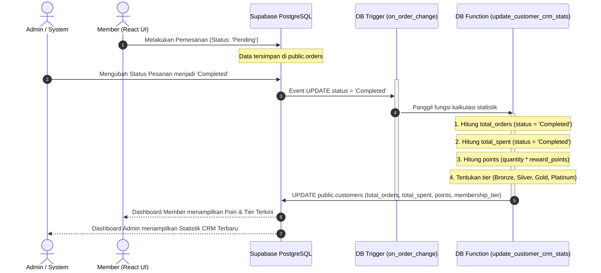
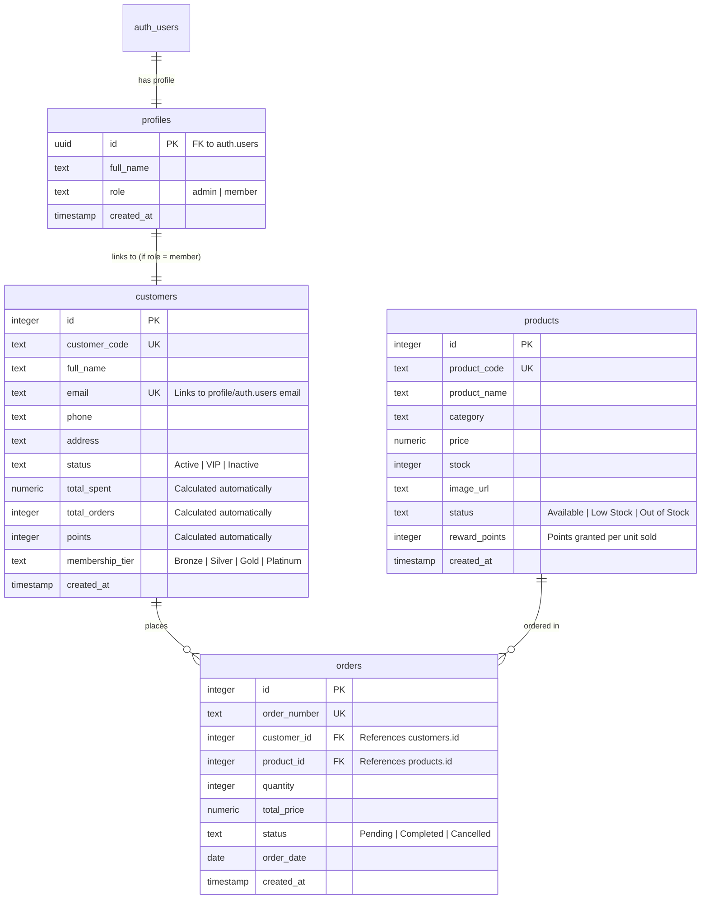

# PRODUCT REQUIREMENTS DOCUMENT (PRD)
## SISTEM LOYALTY POINT & MEMBERSHIP AUTOMATION - BUIQ CRM

---

### 1. INFORMASI DOKUMEN & PERAN
*   **Peran Penulis:** Software Architect
*   **Target Pembaca:** AI Coding Agent / Developer
*   **Nama Fitur:** Loyalty Point & Membership Automation
*   **Status Fitur:** Siap Diimplementasikan (Database-Driven Logic)
*   **Teknologi Utama:** React JS, Supabase PostgreSQL, Tailwind CSS, Shadcn UI

---

### 2. PENDAHULUAN & TUJUAN
Tujuan dari fitur ini adalah membangun sistem loyalitas pelanggan (*customer loyalty*) yang sepenuhnya otomatis di sisi database (Supabase PostgreSQL). Sistem harus menghitung akumulasi poin belanja, jumlah pesanan, total pengeluaran, dan menentukan tingkat keanggotaan (*Membership Tier*) member setiap kali transaksi selesai.

Untuk menjaga integritas data dan performa aplikasi React:
1.  **Semua Logika Bisnis Dihitung di Database:** Perhitungan poin, spent, orders, dan tier dilarang keras dilakukan di kode React. React hanya bertindak sebagai penampil data (*read-only UI*).
2.  **Trigger-Driven Automation:** Perhitungan dipicu secara otomatis oleh PostgreSQL Trigger ketika ada perubahan status pesanan pada tabel `orders` menjadi `Completed`.
3.  **Konsistensi Tier:** Jika ada pesanan yang dibatalkan (`Cancelled`) atau dikembalikan ke status `Pending`, sistem harus secara otomatis mengurangi poin dan menurunkan tier keanggotaan jika akumulasi poin berada di bawah batas minimum (*rollback/downgrade*).

---

### 3. FLOW SISTEM (SYSTEM FLOW)

Berikut adalah alur kerja sistem dari saat pesanan dibuat hingga data ter-update di React UI:



---

### 4. DESAIN DATABASE & RELASI TABEL
Sistem ini menggunakan 4 tabel utama yang saling berelasi:
1.  **`auth.users` (Supabase Built-in):** Tabel autentikasi pengguna.
2.  **`public.profiles`:** Menyimpan data dasar profil pengguna (Admin vs Member).
3.  **`public.customers`:** Menyimpan statistik CRM (Poin, Tier, Total Belanja, Total Order).
4.  **`public.products`:** Menyimpan informasi produk beserta `reward_points` per unit produk.
5.  **`public.orders`:** Menyimpan transaksi pembelian.

#### **Diagram Relasi Tabel (Entity Relationship Diagram - ERD)**



---

### 5. PENAMBAHAN KOLOM PADA TABEL (SCHEMA ALTERATIONS)
Jika tabel sudah ada, jalankan perintah `ALTER TABLE` berikut untuk memastikan kolom-kolom loyalty points terkonfigurasi dengan benar:

```sql
-- 1. Penambahan kolom reward_points pada tabel products
ALTER TABLE public.products 
ADD COLUMN IF NOT EXISTS reward_points integer NOT NULL DEFAULT 0 CHECK (reward_points >= 0);

-- 2. Penambahan kolom points pada tabel customers
ALTER TABLE public.customers 
ADD COLUMN IF NOT EXISTS points integer NOT NULL DEFAULT 0 CHECK (points >= 0);

-- 3. Penambahan kolom membership_tier pada tabel customers
ALTER TABLE public.customers 
ADD COLUMN IF NOT EXISTS membership_tier text NOT NULL DEFAULT 'Bronze' 
CHECK (membership_tier IN ('Bronze', 'Silver', 'Gold', 'Platinum'));

-- 4. Penambahan kolom statistik belanja dasar (jika belum ada)
ALTER TABLE public.customers 
ADD COLUMN IF NOT EXISTS total_spent numeric(15, 2) NOT NULL DEFAULT 0.00 CHECK (total_spent >= 0),
ADD COLUMN IF NOT EXISTS total_orders integer NOT NULL DEFAULT 0 CHECK (total_orders >= 0);
```

---

### 6. FUNCTION DAN TRIGGER POSTGRESQL (DATABASE LOGIC)
Seluruh kalkulasi dilakukan di sisi database menggunakan fungsi pemicu (*Trigger Function*) di bawah ini.

```sql
-- =========================================================================
-- FUNCTION: public.update_customer_crm_stats()
-- Deskripsi: Menghitung ulang total belanja, total pesanan, akumulasi poin,
--            dan memperbarui membership tier berdasarkan pesanan yang 'Completed'.
--            Fungsi ini berjalan dengan hak akses SECURITY DEFINER agar bypass RLS.
-- =========================================================================

CREATE OR REPLACE FUNCTION public.update_customer_crm_stats()
RETURNS trigger AS $$
DECLARE
  v_customer_id integer;
  v_points integer;
  v_total_spent numeric(15,2);
  v_total_orders integer;
  v_tier text;
BEGIN
  -- 1. Identifikasi customer_id yang terdampak perubahan order
  IF TG_OP = 'DELETE' THEN
    v_customer_id := OLD.customer_id;
  ELSE
    v_customer_id := NEW.customer_id;
  END IF;

  -- 2. Hitung jumlah pesanan dengan status 'Completed'
  SELECT count(*) INTO v_total_orders
  FROM public.orders
  WHERE customer_id = v_customer_id AND status = 'Completed';

  -- 3. Hitung total belanja dari pesanan dengan status 'Completed'
  SELECT COALESCE(sum(total_price), 0.00) INTO v_total_spent
  FROM public.orders
  WHERE customer_id = v_customer_id AND status = 'Completed';

  -- 4. Hitung akumulasi reward points dari produk yang dipesan (reward_points * quantity)
  -- Hanya menghitung dari pesanan yang berstatus 'Completed'
  SELECT COALESCE(sum(o.quantity * p.reward_points), 0) INTO v_points
  FROM public.orders o
  JOIN public.products p ON o.product_id = p.id
  WHERE o.customer_id = v_customer_id AND o.status = 'Completed';

  -- 5. Klasifikasikan Membership Tier berdasarkan jumlah poin:
  --    - Bronze   : 0 - 99 Poin
  --    - Silver   : 100 - 499 Poin
  --    - Gold     : 500 - 999 Poin
  --    - Platinum : >= 1000 Poin
  IF v_points >= 1000 THEN
    v_tier := 'Platinum';
  ELSIF v_points >= 500 THEN
    v_tier := 'Gold';
  ELSIF v_points >= 100 THEN
    v_tier := 'Silver';
  ELSE
    v_tier := 'Bronze';
  END IF;

  -- 6. Update data customer di public.customers
  UPDATE public.customers
  SET total_orders = v_total_orders,
      total_spent = v_total_spent,
      points = v_points,
      membership_tier = v_tier
  WHERE id = v_customer_id;

  -- 7. Penanganan Khusus: Jika customer_id pada tabel orders di-update (dipindahkan ke customer lain)
  --    Maka customer lama juga harus dihitung ulang statistiknya.
  IF TG_OP = 'UPDATE' AND OLD.customer_id <> NEW.customer_id THEN
    -- Hitung ulang untuk customer lama (OLD.customer_id)
    SELECT count(*) INTO v_total_orders
    FROM public.orders
    WHERE customer_id = OLD.customer_id AND status = 'Completed';

    SELECT COALESCE(sum(total_price), 0.00) INTO v_total_spent
    FROM public.orders
    WHERE customer_id = OLD.customer_id AND status = 'Completed';

    SELECT COALESCE(sum(o.quantity * p.reward_points), 0) INTO v_points
    FROM public.orders o
    JOIN public.products p ON o.product_id = p.id
    WHERE o.customer_id = OLD.customer_id AND o.status = 'Completed';

    IF v_points >= 1000 THEN
      v_tier := 'Platinum';
    ELSIF v_points >= 500 THEN
      v_tier := 'Gold';
    ELSIF v_points >= 100 THEN
      v_tier := 'Silver';
    ELSE
      v_tier := 'Bronze';
    END IF;

    UPDATE public.customers
    SET total_orders = v_total_orders,
        total_spent = v_total_spent,
        points = v_points,
        membership_tier = v_tier
    WHERE id = OLD.customer_id;
  END IF;

  RETURN NULL;
END;
$$ LANGUAGE plpgsql SECURITY DEFINER;

-- =========================================================================
-- TRIGGER: on_order_change
-- Pemicu: Dijalankan setiap kali ada INSERT, UPDATE, atau DELETE pada tabel orders
-- =========================================================================
DROP TRIGGER IF EXISTS on_order_change ON public.orders;

CREATE TRIGGER on_order_change
  AFTER INSERT OR UPDATE OR DELETE ON public.orders
  FOR EACH ROW EXECUTE FUNCTION public.update_customer_crm_stats();
```

---

### 7. INTEGRASI DATA DAN ATURAN RLS (ROW LEVEL SECURITY)
Keamanan data di Supabase diatur melalui Row Level Security (RLS). Member tidak boleh memiliki akses untuk mengupdate kolom points atau membership_tier mereka secara manual, melainkan hanya melalui sistem database.

#### **Kebijakan RLS (RLS Policies)**
1.  **Tabel `public.customers`:**
    *   **Admin:** Memiliki akses penuh (`ALL`) untuk melihat, menambah, mengupdate, dan menghapus seluruh data customer.
    *   **Member:** Hanya dapat melihat (`SELECT`) data customer mereka sendiri yang dicocokkan berdasarkan alamat email di token JWT (`auth.jwt() ->> 'email'`). Member dilarang mengupdate kolom profil sensitif secara langsung.
2.  **Tabel `public.orders`:**
    *   **Admin:** Akses penuh (`ALL`) untuk mengelola seluruh transaksi.
    *   **Member:** Hanya dapat membaca (`SELECT`) riwayat order miliknya sendiri. Member tidak memiliki hak untuk melakukan `UPDATE` status order menjadi `'Completed'`.

```sql
-- Mengaktifkan RLS pada tabel customers dan orders
ALTER TABLE public.customers ENABLE ROW LEVEL SECURITY;
ALTER TABLE public.orders ENABLE ROW LEVEL SECURITY;

-- Policy untuk tabel customers
DROP POLICY IF EXISTS "Admins have full access to customers" ON public.customers;
CREATE POLICY "Admins have full access to customers" ON public.customers
  FOR ALL TO authenticated USING (
    EXISTS (SELECT 1 FROM public.profiles WHERE id = auth.uid() AND role = 'admin')
  );

DROP POLICY IF EXISTS "Members can select own customer record" ON public.customers;
CREATE POLICY "Members can select own customer record" ON public.customers
  FOR SELECT TO authenticated USING (
    email = auth.jwt() ->> 'email'
  );

-- Policy untuk tabel orders
DROP POLICY IF EXISTS "Admins have full access to orders" ON public.orders;
CREATE POLICY "Admins have full access to orders" ON public.orders
  FOR ALL TO authenticated USING (
    EXISTS (SELECT 1 FROM public.profiles WHERE id = auth.uid() AND role = 'admin')
  );

DROP POLICY IF EXISTS "Members can select own orders" ON public.orders;
CREATE POLICY "Members can select own orders" ON public.orders
  FOR SELECT TO authenticated USING (
    EXISTS (
      SELECT 1 FROM public.customers
      WHERE customers.id = orders.customer_id
      AND customers.email = auth.jwt() ->> 'email'
    )
  );
```

---

### 8. TAHAPAN IMPLEMENTASI (IMPLEMENTATION STEPS)

#### **Fase 1: Eksekusi Skema dan Database Logic di Supabase**
1.  Buka dashboard **Supabase Console** -> Pilih Proyek Anda.
2.  Masuk ke menu **SQL Editor** -> Klik **New Query**.
3.  Salin seluruh kode SQL pada bagian **5 (Penambahan Kolom)**, **6 (Function & Trigger)**, dan **7 (Aturan RLS)**, lalu tempel (*paste*) di SQL Editor.
4.  Klik tombol **Run**. Pastikan eksekusi sukses tanpa error.

#### **Fase 2: Sinkronisasi Awal Data Pelanggan yang Sudah Ada**
Jalankan script migrasi awal berikut di SQL Editor untuk memperbarui poin dan tier seluruh data customer yang sudah ada di database saat ini:

```sql
DO $$
DECLARE
  r record;
BEGIN
  FOR r IN SELECT id FROM public.customers LOOP
    -- Hitung total order, total belanja, dan poin untuk customer r
    UPDATE public.customers c
    SET 
      total_orders = (
        SELECT count(*) FROM public.orders o WHERE o.customer_id = c.id AND o.status = 'Completed'
      ),
      total_spent = COALESCE(
        (SELECT sum(total_price) FROM public.orders o WHERE o.customer_id = c.id AND o.status = 'Completed'), 
        0.00
      ),
      points = COALESCE(
        (SELECT sum(o.quantity * p.reward_points) 
         FROM public.orders o 
         JOIN public.products p ON o.product_id = p.id 
         WHERE o.customer_id = c.id AND o.status = 'Completed'), 
        0
      )
    WHERE c.id = r.id;

    -- Tentukan tier berdasarkan poin yang baru dihitung
    UPDATE public.customers c
    SET membership_tier = CASE 
      WHEN points >= 1000 THEN 'Platinum'
      WHEN points >= 500 THEN 'Gold'
      WHEN points >= 100 THEN 'Silver'
      ELSE 'Bronze'
    END
    WHERE c.id = r.id;
  END LOOP;
END;
$$;
```

#### **Fase 3: Integrasi Tampilan di React JS (Front-End)**
Karena UI sudah ada, AI Coding Agent hanya perlu mengikat data (*data binding*) tanpa mengubah visual layout:
1.  **Dashboard Member:**
    *   Tampilkan field `points` (contoh: `150 Points`) dan `membership_tier` (Bronze/Silver/Gold/Platinum) dari baris customer yang sedang login.
    *   Data ini dibaca secara real-time dari tabel `public.customers` melalui Supabase Client.
2.  **Dashboard Admin (Customer Management):**
    *   Tampilkan kolom-kolom baru: `Points` dan `Membership Tier` di tabel list customer admin.
    *   Pastikan saat admin mengubah status pesanan pelanggan di Order Management, data di list customer otomatis ter-refresh secara real-time (bisa menggunakan *Supabase Realtime Subscription* atau refetch setelah aksi).

---

### 9. SKENARIO TESTING (TESTING SCENARIOS)

Jalankan skenario pengujian berikut di SQL Editor Supabase untuk memverifikasi apakah trigger bekerja 100% secara akurat.

#### **Persiapan Data Uji**
```sql
-- Tambah data produk uji
INSERT INTO public.products (id, product_code, product_name, category, price, stock, reward_points)
VALUES (999, 'TST-BAG', 'Tas Premium Uji', 'Bag', 500000.00, 100, 50)
ON CONFLICT (id) DO UPDATE SET reward_points = EXCLUDED.reward_points;

-- Tambah data customer uji
INSERT INTO public.customers (id, customer_code, full_name, email, phone, status)
VALUES (999, 'CUST-TST', 'Budi Tester', 'budi.test@example.com', '0899111222', 'Active')
ON CONFLICT (id) DO NOTHING;
```

#### **Skenario 1: Pesanan Pertama Dibuat dengan Status 'Pending'**
*   **Aksi:** Masukkan pesanan baru dengan status `'Pending'`.
*   **Query SQL:**
    ```sql
    INSERT INTO public.orders (id, order_number, customer_id, product_id, quantity, total_price, status)
    VALUES (9991, 'ORD-TST-01', 999, 999, 2, 1000000.00, 'Pending');
    ```
*   **Hasil yang Diharapkan:** Statistik pelanggan Budi Tester harus tetap **0 Poin, 0 Orders, 0 Total Spent, dan Tier 'Bronze'** karena pesanan belum selesai.
*   **Query Verifikasi:**
    ```sql
    SELECT points, total_orders, total_spent, membership_tier FROM public.customers WHERE id = 999;
    ```

#### **Skenario 2: Mengubah Status Pesanan menjadi 'Completed'**
*   **Aksi:** Update status order `ORD-TST-01` dari `'Pending'` menjadi `'Completed'`.
*   **Query SQL:**
    ```sql
    UPDATE public.orders SET status = 'Completed' WHERE id = 9991;
    ```
*   **Hasil yang Diharapkan:** Budi Tester mendapatkan reward point: `2 x 50 poin = 100 Poin`. Total belanja menjadi `Rp1.000.000`, Total order = `1`, dan tier keanggotaan ter-upgrade secara otomatis dari **Bronze** menjadi **Silver** (karena poin >= 100).
*   **Query Verifikasi:**
    ```sql
    SELECT points, total_orders, total_spent, membership_tier FROM public.customers WHERE id = 999;
    ```

#### **Skenario 3: Akumulasi Poin Tambahan & Upgrade Tier Lebih Tinggi**
*   **Aksi:** Budi membeli produk lagi sebanyak `8` unit (total reward point: `8 x 50 = 400 poin`) dengan status langsung `'Completed'`.
*   **Query SQL:**
    ```sql
    INSERT INTO public.orders (id, order_number, customer_id, product_id, quantity, total_price, status)
    VALUES (9992, 'ORD-TST-02', 999, 999, 8, 4000000.00, 'Completed');
    ```
*   **Hasil yang Diharapkan:** Akumulasi poin menjadi `100 + 400 = 500 Poin`. Total belanja menjadi `Rp5.000.000`. Total order = `2`. Membership tier ter-upgrade menjadi **Gold** (karena poin >= 500).
*   **Query Verifikasi:**
    ```sql
    SELECT points, total_orders, total_spent, membership_tier FROM public.customers WHERE id = 999;
    ```

#### **Skenario 4: Pembatalan Pesanan (Rollback/Downgrade Tier)**
*   **Aksi:** Pesanan kedua (`ORD-TST-02`) dibatalkan oleh Admin sehingga status berubah menjadi `'Cancelled'`.
*   **Query SQL:**
    ```sql
    UPDATE public.orders SET status = 'Cancelled' WHERE id = 9992;
    ```
*   **Hasil yang Diharapkan:** Poin berkurang kembali menjadi `100 Poin`. Total belanja berkurang menjadi `Rp1.000.000`. Total order kembali menjadi `1`. Membership tier **turun kembali (*downgrade*)** secara otomatis dari **Gold** menjadi **Silver** karena poin tersisa kurang dari 500.
*   **Query Verifikasi:**
    ```sql
    SELECT points, total_orders, total_spent, membership_tier FROM public.customers WHERE id = 999;
    ```

#### **Skenario 5: Penghapusan Pesanan (DELETE Order)**
*   **Aksi:** Pesanan pertama (`ORD-TST-01`) dihapus secara permanen dari database.
*   **Query SQL:**
    ```sql
    DELETE FROM public.orders WHERE id = 9991;
    ```
*   **Hasil yang Diharapkan:** Statistik pelanggan kembali bersih: **0 Poin, 0 Orders, 0 Total Spent, dan Tier kembali ke 'Bronze'**.
*   **Query Verifikasi:**
    ```sql
    SELECT points, total_orders, total_spent, membership_tier FROM public.customers WHERE id = 999;
    ```

#### **Pembersihan Data Uji**
```sql
DELETE FROM public.orders WHERE customer_id = 999;
DELETE FROM public.customers WHERE id = 999;
DELETE FROM public.products WHERE id = 999;
```
